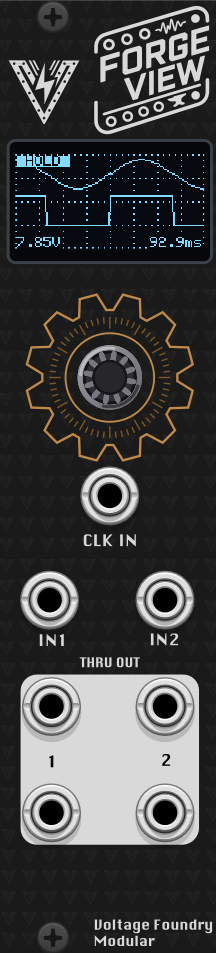

# ForgeView: A scope for Eurorack

## Overview

ForgeView is an essential oscilloscope for Eurorack systems. It can be used to visualize waveforms and signals in your modular system. The module has a 0.96" OLED display and can be used to visualize waveforms from LFOs, envelopes, oscillators, filters, and other signals in your system.

The module also exists as a VCV Rack plugin, which can be used to try the module virtually before building the hardware.

Part of the **Forge** series of modules which share a single hardware platform.

The hardware schematics and design files are completely open-source and available in the [GitHub repository](https://github.com/VoltageFoundryMod/ForgeSeries-Hardware).

Check it out on [ModularGrid](https://modulargrid.net/e/other-unknown-forgeview-by-voltage-foundry-modular).

## Features

- **6 modes of operation** — dual-trace scope, single-trace scope, triggered single-shot capture, spectrum analyzer, X-Y (Lissajous) display, and a tuner / frequency meter.
- **Per-mode settings menu** — each mode has its own parameter list, edited with the encoder.
- **Engineering-unit readouts** — optional V/div and time/div axis labels, plus a peak-frequency readout in Spectrum mode.
- **Freeze-frame** — long-press the encoder in any mode to hold the current display.
- **Persistent settings** — the selected mode and all parameters are saved automatically and restored at power-up.
- **Signal pass-through** — both inputs are buffered and copied to the outputs so the scope can sit in the middle of a patch.

The current hardware design supports input signals from 0 to 5V, and the outputs are also 0-5V. The module is intended for visualization and not for high precision measurements. The VCV Rack plugin module can be set to accept CV signals in the range of 0 to 5V like the hardware, -5 to +5V or 0 to 10V for more flexibility. The hardware might support other input/output ranges in the future but for now, voltages higher than 5V will be clipped and voltages lower than 0V will be ignored.

## Usage

For more details and usage instructions, see [Manual.md](Manual.md).

## Contact

For support and inquiries, please open an issue on the [GitHub repository](https://github.com/VoltageFoundryMod/ForgeSeries).

## Acknowledgements

Great part of the code are inspired by Hagiwo's code.
Thanks for the inspiration!

## License

This project is licensed under the MIT License. See the `LICENSE` file for more information.

---

Thank you for choosing the ForgeView module. We hope it enhances your musical creativity and performance.
