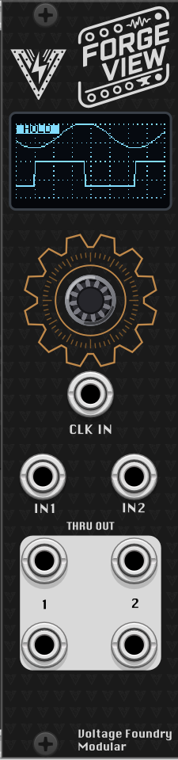
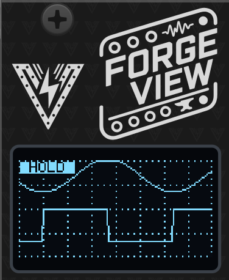
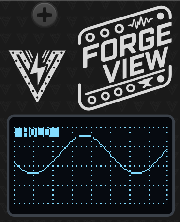
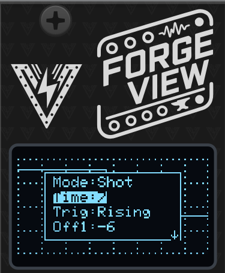
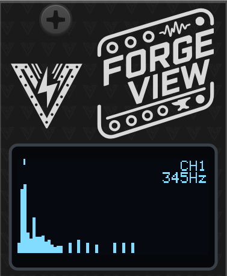
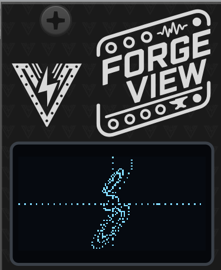
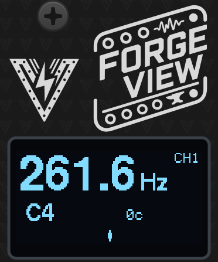
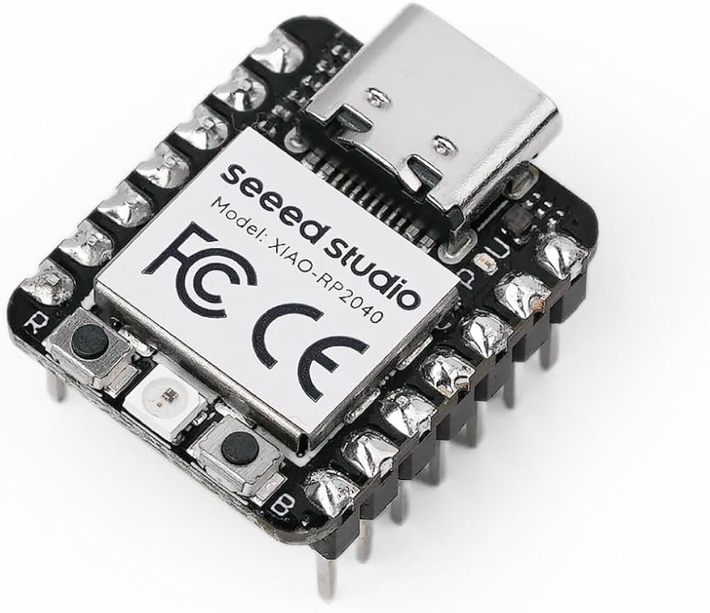

# ForgeView: A scope for Eurorack

## Overview

ForgeView is an essential oscilloscope for Eurorack systems. It can be used to visualize waveforms and signals in your modular system. The module has a 0.96" OLED display and can be used to visualize waveforms from LFOs, envelopes, oscillators, filters, and other signals in your system.

The module also exists as a VCV Rack plugin, which can be used to try the module virtually before building the hardware.

Part of the **Forge** series of modules which share a single hardware platform.

The hardware schematics and design files are completely open-source and available in the [GitHub repository](https://github.com/VoltageFoundryMod/ForgeSeries-Hardware).

Check it out on [ModularGrid](https://modulargrid.net/e/modules/view/52717).

## Features

- **6 modes of operation** — dual-trace scope, single-trace scope, triggered single-shot capture, spectrum analyzer, X-Y (Lissajous) display, and a tuner / frequency meter.
- **Per-mode settings menu** — each mode has its own parameter list, edited with the encoder.
- **Engineering-unit readouts** — optional V/div and time/div axis labels, plus a peak-frequency readout in Spectrum mode.
- **Freeze-frame** — long-press the encoder in any mode to hold the current display.
- **Persistent settings** — the selected mode and all parameters are saved automatically and restored at power-up.
- **Signal pass-through** — both inputs are buffered and copied to the outputs so the scope can sit in the middle of a patch.

The current hardware design supports input signals from 0 to 5V, and the outputs are also 0-5V. The module is intended for visualization and not for high precision measurements. The VCV Rack plugin module can be set to accept CV signals in the range of 0 to 5V like the hardware, -5 to +5V or 0 to 10V for more flexibility. The hardware might support other input/output ranges in the future but for now, voltages higher than 5V will be clipped and voltages lower than 0V will be ignored.

## Display Modes

### Dual (dual-trace scope)

Displays IN1 and IN2 simultaneously as two rolling traces — ideal for slow signals like LFOs and envelopes. Each trace has its own vertical offset (`Off1` / `Off2`) so the channels can be separated on screen; the vertical scale (`Vert`) and timebase (`Time`) are shared.

### Single (audio-rate scope)

Displays IN1 only, with a faster default timebase for audio-rate signals. The `Refr` (refresh) parameter divides the screen refresh rate to steady the display on periodic waveforms.

### Shot (triggered single-shot capture)

Captures a single sweep of IN1 when a trigger arrives on the TRIG input — like taking a snapshot of a drum hit or envelope. The captured trace stays on screen until the next trigger. The `Trig` parameter selects the trigger behavior:

- **Off** — free-running roll, no trigger required.
- **Rising** — capture starts on a rising edge at TRIG.
- **Falling** — capture starts on a falling edge at TRIG.
- **Auto** — triggers on a rising edge, but self-triggers after 250 ms without one, so a trace always appears.

### Spectrum (spectrum analyzer)

Displays a real-time 128-point FFT of IN1 or IN2 as 64 frequency bins. A marker and readout show the peak frequency and input being shown (when `Info` is on). Parameters:

- **High** — high-frequency emphasis, tilts the display up to compensate for the natural roll-off of harmonic content.
- **Filt** — noise floor: bins below this level are hidden.

### X-Y (Lissajous)

Plots IN1 against IN2 (IN1 = X, IN2 = Y) like a scope in X-Y mode — useful for phase relationships, Lissajous figures, and stereo-style visualization. The `Pers` (persistence) parameter emulates a phosphor screen: points stay visible from "Live" up to 5 minutes, letting slow figures accumulate.

### Tuner (frequency meter)

Measures the frequency of the selected input (`Chan`: CH1 or CH2) and shows a large Hz readout, the nearest note name and octave, and a cents-deviation bar for tuning oscillators. The readout blanks when the signal is too small to measure.

## Controls

Turning the encoder opens the settings overlay for the current mode. The overlay hides itself about 5 seconds after the last interaction.

- **Turn** — move the cursor through the parameter list.
- **Click** — start editing the selected parameter; turn to change the value, click again to stop editing. (On/off rows like `Info` toggle directly with a click.)
- **Long press (~1 s)** — freeze / unfreeze the display. A `HOLD` indicator is shown while frozen; new samples are ignored until unfrozen.

### Parameters

| Parameter | Modes                   | Function                                           |
| --------- | ----------------------- | -------------------------------------------------- |
| `Mode`    | all                     | Select the display mode                            |
| `Time`    | Dual, Single, Shot      | Horizontal timebase (higher = slower sweep)        |
| `Trig`    | Shot                    | Trigger mode: Off, Rising, Falling, Auto           |
| `Off1`    | Dual, Single, Shot      | Channel 1 vertical offset                          |
| `Off2`    | Dual                    | Channel 2 vertical offset                          |
| `Vert`    | Dual, Single, Shot, X-Y | Vertical scale (gain)                              |
| `Refr`    | Single                  | Screen refresh divider                             |
| `High`    | Spectrum                | High-frequency emphasis                            |
| `Filt`    | Spectrum                | Noise floor                                        |
| `Pers`    | X-Y                     | Phosphor persistence (Live to 5 min)               |
| `Chan`    | Tuner                   | Measured input channel (CH1 / CH2)                 |
| `Info`    | all except Tuner        | Show axis labels (V/div, time/div, peak frequency) |

All settings (mode included) are saved automatically about 5 seconds after the last change and restored on the next power-up.

## Operation

### Interface

- **TRIG**: External trigger input for Shot mode (0-5V)
- **IN1, IN2**: CV/audio inputs for the displayed signals (0-5V)
- **OUT 1 / 2**: Buffered copies of IN1 and IN2 (0-5V)
- **OUT 3 / 4**: Additional buffered copies of IN1 and IN2 (0-5V)

The signals from IN1 and IN2 are sampled and copied to the outputs (IN1 to OUT1 and OUT3, IN2 to OUT2 and OUT4), so the module can be patched inline as a buffered multiple. Do not expect high resolution and accuracy on the outputs or the display. The module is intended for visualization and not for high precision measurements. The outputs might not perfectly match the inputs since they are software processed and not electronically buffered and connected (specially with audio material).

## VCV Rack Plugin

A [VCV Rack](https://vcvrack.com/) version of the module, sharing the same engine code as the firmware, is available in the [vcv-plugin](vcv-plugin/) directory of the repository. It can be used to try the module virtually before building the hardware.

## Firmware Update

1. Download the latest firmware from the Releases section of the [GitHub repository](https://github.com/VoltageFoundryMod/ForgeSeries/releases). The firmware file is named `CURRENT.UF2`.
2. Connect the module to your computer using a USB-C cable while holding the small BOOT (B) button. The CPU can be removed from the module as it's socketed to the main board if desired. Firmware loading can be done with the CPU removed.
3. A new drive will show on your computer named RPI-RP2. Copy and overwrite the `CURRENT.UF2` file to the module USB drive. After copy is finished, the module will reboot and the new firmware will be loaded.

## Troubleshooting

- **No Power**: Ensure the module is properly connected to the power supply and the power jumper is set correctly.
- **No Output**: Verify the board connections and output settings and ensure the module is not stopped.
- **Display frozen**: Check for the `HOLD` indicator — a long press of the encoder freezes the display; long-press again to resume.

## Powering

The module uses only 5V internally. This can be provided directly by a Eurorack supply with a 5V rail, or taken from the 12V line and converted to 5V on-board. The source is selected with an on-board jumper: closing the center pin to **INT REG** takes power from the Eurorack 12V supply, while closing the center pin to **EURO** takes power from the 5V rail (requires a 16-pin cable). It can also be powered from the USB-C jack on the microcontroller board.

**Never connect both the Eurorack power and the USB-C power at the same time**. The module might be damaged or even damage your computer if both are connected. The module is designed to be powered from either source, not both.

## Specifications

- **Power Supply**: 12V or 5V jumper selectable
- **Input CV Range**: 0–5V
- **Output CV Range**: 0–5V
- **Dimensions**: 6HP
- **Depth**: 40mm
- **Current Draw**: 60mA @ +12V or +5V

## Contact

For support and inquiries, please open an issue on the [GitHub repository](https://github.com/VoltageFoundryMod/ForgeSeries).

## Development

If you want to build and develop for the module, check [this file](Building-Developing.md) for more information.

## Acknowledgements

Great part of the code are inspired by Hagiwo's code.
Thanks for the inspiration!

## License

This project is licensed under the MIT License. See the `LICENSE` file for more information.

---

Thank you for choosing the ForgeView module. We hope it enhances your musical creativity and performance.
